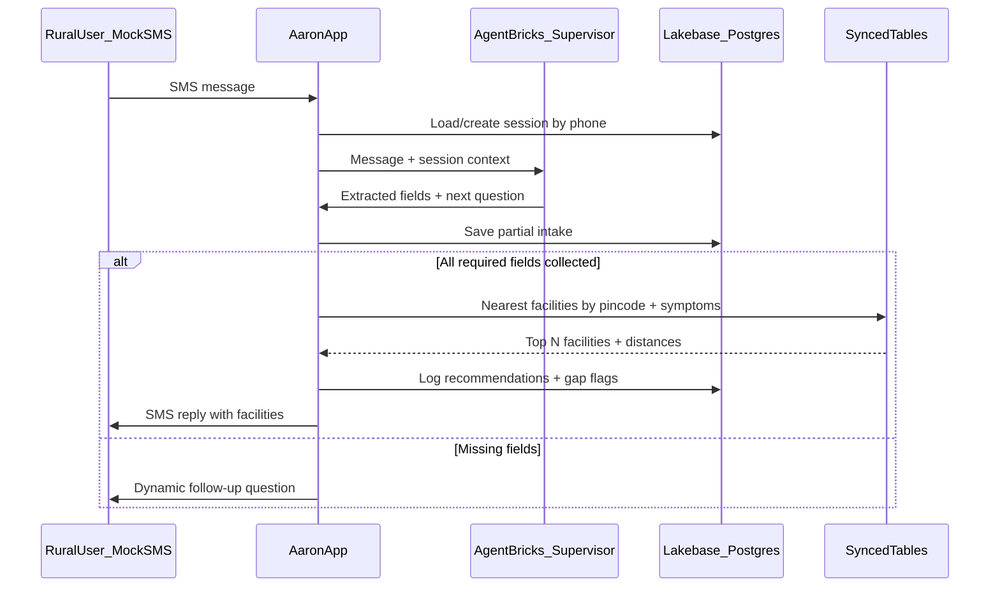

# Aaron: SMS Health Check & Location Agent

## Decisions Locked In

| Decision | Choice |
|----------|--------|
| SMS interface | **Mock SMS** — in-app chat UI + `POST /api/sms/inbound` for curl demos; real Twilio can be added later |
| Facility reads | **Lakebase synced tables** — sync `facilities` + `india_post_pincode_directory` into Postgres for fast proximity queries |
| Databricks profile | **`hackathon-dais`** → `https://dbc-90be8f46-8e3a.cloud.databricks.com/` (PAT stored in `~/.databrickscfg`, never committed) |
| App name | **`aaron`** (≤26 chars, AppKit convention) |

## Available Data (already in Unity Catalog)

Catalog: `databricks_virtue_foundation_dataset_dais_2026.virtue_foundation_dataset`

| Table | Rows | Role |
|-------|------|------|
| [`facilities`](databricks_virtue_foundation_dataset_dais_2026.virtue_foundation_dataset.facilities) | ~10,088 | Medical facilities with `latitude`, `longitude`, `specialties`, `capability`, `address_*`, `officialPhone` |
| [`india_post_pincode_directory`](databricks_virtue_foundation_dataset_dais_2026.virtue_foundation_dataset.india_post_pincode_directory) | — | Pincode → lat/lon, district, state |
| [`nfhs_5_district_health_indicators`](databricks_virtue_foundation_dataset_dais_2026.virtue_foundation_dataset.nfhs_5_district_health_indicators) | — | District-level health context (optional enrichment in responses) |

**Note:** There is no pre-built "users" table — "users" in the brief means **SMS end-users we persist in Lakebase**, plus a derived view of users whose nearest appropriate facility exceeds a distance threshold (coverage gap analysis).

Warehouse: `e4e23f31c3028908` (Serverless Starter Warehouse)

---

## Architecture



---

## Phase 0: Workspace Setup

1. **Configure CLI profile** in `~/.databrickscfg`:
   ```ini
   [hackathon-dais]
   host  = https://dbc-90be8f46-8e3a.cloud.databricks.com
   token = <PAT>
   ```
   All future CLI commands use `--profile hackathon-dais`.

2. **Init git repo** in `/Users/annahart/IdeaProjects/hackaton` with `.gitignore` excluding secrets, `.env`, `node_modules`.

3. **Start warehouse** before any SQL/sync operations:
   ```bash
   databricks warehouses start e4e23f31c3028908 --profile hackathon-dais
   ```

---

## Phase 1: Lakebase Project + Synced Tables

1. **Create Lakebase project** (Autoscaling):
   ```bash
   databricks postgres create-project aaron-health \
     --json '{"spec": {"display_name": "Aaron Health Agent"}}' \
     --profile hackathon-dais
   ```

2. **Enable CDF on source tables** (required for sync):
   ```sql
   ALTER TABLE databricks_virtue_foundation_dataset_dais_2026.virtue_foundation_dataset.facilities
     SET TBLPROPERTIES (delta.enableChangeDataFeed = true);
   ALTER TABLE ...india_post_pincode_directory
     SET TBLPROPERTIES (delta.enableChangeDataFeed = true);
   ```

3. **Create synced tables** via CLI (not DABs — Autoscaling uses `databricks postgres create-synced-table`):
   - Sync `facilities` → Postgres schema `public.facilities`
   - Sync `india_post_pincode_directory` → `public.pincode_directory`
   - Sync only columns needed for lookup (name, lat, lon, specialties, capability, address fields, phone, organization_type, pincode, district, statename)

4. **Add indexes** on synced tables after sync is ONLINE:
   ```sql
   CREATE INDEX idx_pincode ON pincode_directory (pincode);
   CREATE INDEX idx_facilities_lat_lon ON facilities (latitude, longitude);
   ```

---

## Phase 2: Scaffold Aaron App

Run manifest discovery, then init with hybrid features:

```bash
databricks apps manifest --profile hackathon-dais
databricks apps init --name aaron \
  --features analytics,lakebase,agents \
  --set analytics.sql-warehouse.id=e4e23f31c3028908 \
  --set lakebase.postgres.branch=projects/aaron-health/branches/production \
  --set lakebase.postgres.database=<DATABASE_RESOURCE_PATH> \
  --set agents.agents-serving-endpoint.name=databricks-claude-opus-4-8 \
  --description "SMS health intake and facility finder for rural users" \
  --run none --profile hackathon-dais
```

**Deploy before local dev** (Lakebase SP must own the schema):
```bash
databricks apps deploy aaron --profile hackathon-dais
```

---

## Phase 3: Lakebase Application Schema (CRUD tables)

Created by app SP on startup via `pool.query()` in [`server/server.ts`](server/server.ts):

```sql
-- SMS sessions (one per phone number)
CREATE TABLE sms_sessions (
  id UUID PRIMARY KEY DEFAULT gen_random_uuid(),
  phone TEXT NOT NULL UNIQUE,
  status TEXT NOT NULL DEFAULT 'collecting',  -- collecting | complete | recommended
  postal_code TEXT,
  age INT,
  symptoms TEXT,
  district TEXT,
  state TEXT,
  user_lat DOUBLE PRECISION,
  user_lon DOUBLE PRECISION,
  created_at TIMESTAMPTZ DEFAULT now(),
  updated_at TIMESTAMPTZ DEFAULT now()
);

-- Conversation turns (mock SMS thread)
CREATE TABLE sms_messages (
  id UUID PRIMARY KEY DEFAULT gen_random_uuid(),
  session_id UUID REFERENCES sms_sessions(id),
  direction TEXT NOT NULL,  -- inbound | outbound
  body TEXT NOT NULL,
  created_at TIMESTAMPTZ DEFAULT now()
);

-- Facility recommendations + gap analysis
CREATE TABLE facility_recommendations (
  id UUID PRIMARY KEY DEFAULT gen_random_uuid(),
  session_id UUID REFERENCES sms_sessions(id),
  facility_name TEXT,
  facility_phone TEXT,
  distance_km DOUBLE PRECISION,
  specialties TEXT,
  rank INT,
  is_nearest_appropriate BOOLEAN,
  created_at TIMESTAMPTZ DEFAULT now()
);

-- Coverage gap summary (derived at recommendation time)
CREATE TABLE coverage_gaps (
  id UUID PRIMARY KEY DEFAULT gen_random_uuid(),
  session_id UUID REFERENCES sms_sessions(id),
  nearest_distance_km DOUBLE PRECISION,
  gap_threshold_km DOUBLE PRECISION DEFAULT 50,
  has_coverage_gap BOOLEAN,
  symptoms TEXT,
  postal_code TEXT,
  created_at TIMESTAMPTZ DEFAULT now()
);
```

---

## Phase 4: Agent Bricks — Conversational Intake

**Approach:** AppKit `agents` plugin + a structured extraction agent (markdown config in `config/agents/intake-agent.md`).

### Agent behavior

- **Goal:** Extract three required fields via dynamic multi-turn SMS dialogue:
  1. **Location** (Indian postal code / pincode) — highest priority
  2. **Age**
  3. **Symptoms** (free text)

- **System prompt rules:**
  - Ask one question at a time; keep replies ≤160 chars (SMS-friendly)
  - If user sends everything at once, parse all fields
  - Validate pincode: 6 digits; resolve via `pincode_directory` synced table
  - Never provide medical diagnosis — only facility routing
  - When all three fields present, signal `READY_FOR_LOOKUP`

- **Structured output schema** (JSON tool response):
  ```json
  {
    "postal_code": "504273",
    "age": 45,
    "symptoms": "chest pain and fever",
    "missing_fields": [],
    "reply_message": "Found 3 clinics near you...",
    "ready_for_lookup": true
  }
  ```

### Optional: Supervisor Agent (Agent Bricks CLI)

For hackathon demo credibility, also create a Supervisor Agent wired to a UC function tool:

```bash
databricks supervisor-agents create-supervisor-agent "Aaron Health Intake" \
  --description "Extracts location, age, symptoms from SMS" \
  --instructions "Collect postal code first, then age, then symptoms. Route facility queries to lookup function." \
  --profile hackathon-dais
```

Attach UC function `workspace.aaron.lookup_facilities(postal_code, symptoms, age)` as a tool.

---

## Phase 5: Facility Lookup (Lakebase Synced Tables)

Postgres query in tRPC procedure `facilities.findNearby`:

```sql
WITH user_loc AS (
  SELECT AVG(latitude::float) AS lat, AVG(longitude::float) AS lon,
         MAX(district) AS district, MAX(statename) AS state
  FROM pincode_directory
  WHERE pincode = $1 AND latitude != 'NA'
),
scored AS (
  SELECT f.name, f.officialphone, f.specialties, f.capability,
         f.address_city, f.address_stateorregion,
         6371 * 2 * ASIN(SQRT(
           POWER(SIN(RADIANS(f.latitude - u.lat)/2), 2) +
           COS(RADIANS(u.lat)) * COS(RADIANS(f.latitude)) *
           POWER(SIN(RADIANS(f.longitude - u.lon)/2), 2)
         )) AS dist_km
  FROM facilities f CROSS JOIN user_loc u
  WHERE f.latitude IS NOT NULL
    AND f.organization_type = 'facility'
    AND (
      $2 = '' OR f.specialties ILIKE '%' || $2 || '%'
           OR f.capability ILIKE '%' || $2 || '%'
    )
)
SELECT * FROM scored ORDER BY dist_km LIMIT 5;
```

**Symptom → specialty mapping** (simple keyword map in code, e.g. "chest pain" → `cardiology`, "pregnancy" → `gynecology`).

**Gap detection:** If nearest facility `dist_km > 50` (configurable), set `has_coverage_gap = true` and include distance in SMS reply.

---

## Phase 6: Mock SMS Interface

### Backend endpoints (tRPC or FastAPI route in app)

| Endpoint | Purpose |
|----------|---------|
| `POST /api/sms/inbound` | `{ phone, message }` — simulates inbound SMS |
| `GET /api/sms/thread/:phone` | Returns conversation history |

### Frontend ([`client/src/App.tsx`](client/src/App.tsx))

- **Left panel:** Phone number input + chat thread (mimics SMS)
- **Right panel:** Admin view — extracted fields, recommended facilities, gap flag
- **Demo curl:**
  ```bash
  curl -X POST https://<aaron-app-url>/api/sms/inbound \
    -H 'Content-Type: application/json' \
    -d '{"phone":"+919876543210","message":"I am in pincode 504273, age 45, having fever"}'
  ```

---

## Phase 7: Analytics Dashboard (optional, `--features analytics`)

SQL queries in [`config/queries/`](config/queries/) for judges/demo:

| Query file | Purpose |
|------------|---------|
| `coverage_gaps.sql` | Users with nearest facility > 50 km |
| `intake_summary.sql` | Count by status, avg distance |
| `symptoms_by_district.sql` | Symptom patterns by district |

These read from Lakebase-synced recommendation data (either sync back to UC or query Lakebase directly in tRPC for the dashboard).

---

## Phase 8: Deploy & Demo Script

1. `databricks apps validate --profile hackathon-dais`
2. `databricks apps deploy aaron --profile hackathon-dais`
3. Update [`tests/smoke.spec.ts`](tests/smoke.spec.ts) selectors for chat UI
4. **Demo flow:**
   - User: "I don't feel well"
   - Agent: "What is your postal code (pincode)?"
   - User: "504273"
   - Agent: "How old are you?"
   - User: "45"
   - Agent: "What symptoms are you experiencing?"
   - User: "chest pain and fever"
   - Agent: Returns 3 nearest facilities with phone numbers and distances; flags if >50 km

---

## File Layout (after scaffold)

```
hackaton/
├── aaron/                          # Databricks App (AppKit)
│   ├── app.yaml
│   ├── databricks.yml
│   ├── client/src/App.tsx          # Mock SMS chat UI
│   ├── server/server.ts            # tRPC: sms, facilities, sessions
│   ├── config/agents/intake-agent.md
│   └── config/queries/             # Gap analysis dashboards
├── docs/
│   └── dataset-notes.md            # UC table reference
└── README.md                       # Setup, profile, demo instructions
```

---

## Risks & Mitigations

| Risk | Mitigation |
|------|------------|
| Lakebase SP schema ownership | Deploy app before local dev; SP creates schema |
| Synced table CDF not enabled | Run ALTER TABLE before create-synced-table |
| Warehouse stopped | Start warehouse in Phase 0; auto-stop after 10 min |
| Agent replies too long for SMS | Enforce 160-char limit in agent prompt + truncate |
| Facility data quality (bad org_type values) | Filter `organization_type = 'facility'` (~10K clean rows) |
| API token in chat | Store in profile only; rotate after hackathon |

---

## Out of Scope (post-hackathon)

- Real Twilio SMS integration (webhook swap is straightforward once mock works)
- Medical triage / diagnosis
- Multi-language support (English first; Hindi later)
